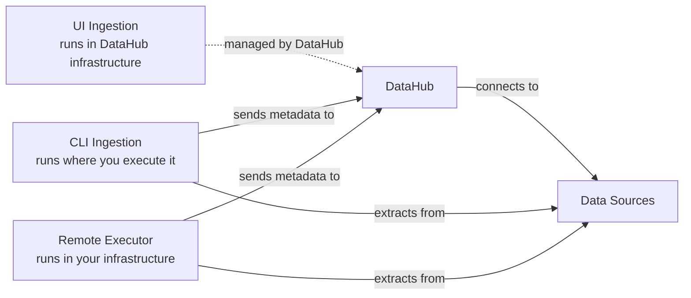

# Ingestion 보안 비교

DataHub는 메타데이터를 수집하는 세 가지 방법을 지원합니다. 주로 자격 증명이 저장되는 위치와 필요한 네트워크 접근 방식에서 차이가 있습니다.

## 빠른 비교

|                     | **자격 증명**                                | **실행 위치**                                                                        | **네트워크**                                                                           | **방화벽/IP 허용 목록 조정**                                                   |
| ------------------- | -------------------------------------------- | ------------------------------------------------------------------------------------ | -------------------------------------------------------------------------------------- | ------------------------------------------------------------------------------ |
| **UI Ingestion**    | DataHub에 암호화 저장                        | DataHub 인프라                                                                       | DataHub 인프라가 데이터 소스에 연결                                                    | 방화벽 뒤에 있거나 IP 허용 목록이 있는 소스에 필요                             |
| **CLI Ingestion**   | 로컬 파일/환경 변수                          | 실행하는 어디서든 (개인 컴퓨터, CI/CD, Airflow/Cron 등의 스케줄러)                  | CLI가 데이터 소스에 연결한 후 메타데이터를 DataHub로 전송                              | CLI 실행 위치와 해당 컴퓨터의 연결성 여부에 따라 다름                          |
| **Remote Executor** | 사용자 인프라 (AWS Secrets, K8s 등)          | 사용자 인프라에 배포 (K8s, ECS 등)                                                   | Executor가 데이터 소스에 연결한 후 메타데이터를 DataHub로 전송 (아웃바운드만)          | Executor 실행 위치와 해당 컴퓨터의 연결성 여부에 따라 다름                     |

### 네트워크 흐름 다이어그램

## 자격 증명이 저장되는 위치

### UI Ingestion

자격 증명은 암호화 키로 암호화되어 DataHub 데이터베이스에 저장됩니다. DataHub가 암호화를 관리하고 데이터 소스에 연결할 때 이 자격 증명을 사용합니다.

### CLI Ingestion

자격 증명은 레시피 파일을 통해 사용자의 인프라에 저장됩니다. **모범 사례: 레시피 파일에 자격 증명을 하드코딩하지 않고 항상 환경 변수를 사용하세요.** 로컬 시크릿 관리자와 통합할 수도 있습니다.

### Remote Executor

다음과 같은 사용자 인프라의 엔터프라이즈 시크릿 관리 시스템과 통합됩니다:

- AWS Secrets Manager
- Kubernetes Secrets
- External Secrets Operator
- HashiCorp Vault
- 기타 시크릿 관리 솔루션

## 네트워크 패턴

### UI Ingestion

DataHub의 인프라가 데이터 소스에 직접 연결합니다. 소스에 따라 DataHub의 접근을 허용하도록 소스를 구성해야 합니다:

- **클라우드 소스** (Snowflake, BigQuery 등): DataHub IP를 허용 목록에 추가해야 할 수 있음
- **온프레미스 소스**: DataHub가 접근할 수 있도록 VPN 터널이나 방화벽 규칙이 필요할 수 있음

### CLI Ingestion

CLI는 실행되는 어디서든 동작합니다 (개인 컴퓨터, CI/CD, 클라우드 인스턴스, Airflow/Cron 등의 스케줄러). 먼저 데이터 소스에 연결하여 메타데이터를 추출한 다음, 해당 메타데이터를 DataHub로 전송합니다. 네트워크 요구 사항은 CLI가 실행되는 위치와 해당 컴퓨터가 소스와 DataHub 모두에 이미 연결성이 있는지에 전적으로 달려 있습니다.

### Remote Executor

데이터 소스와 DataHub 모두에 접근할 수 있는 사용자의 인프라(Kubernetes, ECS 등)에 소프트웨어로 배포됩니다. CLI와 마찬가지로 먼저 소스에 연결한 다음 메타데이터를 DataHub로 전송합니다.

**핵심 장점**: 아웃바운드 연결만 수행합니다. 외부 시스템을 위해 인바운드 방화벽 포트를 열거나 VPN 접근을 구성할 필요가 없으며, Executor 소프트웨어는 사용자의 네트워크 경계 내에서 완전히 실행됩니다.

## 언제 어떤 방법을 사용할까

대부분의 조직은 특정 요구 사항에 따라 세 가지 방법을 조합하여 사용합니다. 일반적인 패턴은 다음과 같습니다:

### UI Ingestion - 다음에 적합:

- **클라우드 호스팅 데이터 소스**: Snowflake, BigQuery, Redshift, Tableau, Looker, PowerBI 등
- **단순함을 원할 때**: 내장 스케줄링, 관리할 인프라 없음, 가장 쉽게 확장 가능
- **빠른 시작**: 최소한의 설정만 필요

**장점**: 스케줄링과 규모 모두에서 가장 간단합니다. DataHub가 모든 인프라와 오케스트레이션을 처리합니다.

### CLI Ingestion - 다음에 적합:

- **로컬 파일이 필요한 소스**: dbt 프로젝트, 커스텀 SQL 쿼리, 로컬 변환
- **CI/CD 파이프라인**: 빌드/배포 프로세스에 메타데이터 ingestion 통합
- **개발 및 테스트**: ingestion 레시피의 빠른 반복 및 테스트
- **커스텀 오케스트레이션**: 스케줄링에 대한 세밀한 제어가 필요할 때 (Airflow, Cron 등)

**스케줄링**: 외부 스케줄러 필요 (Airflow, Cron, Kubernetes CronJob 등)

### Remote Executor - 다음에 적합:

- **네트워크 내부 데이터베이스**: 온프레미스 데이터베이스, 내부 데이터 웨어하우스
- **엄격한 보안 요구 사항**: 자격 증명이 인프라를 벗어날 수 없는 경우
- **방화벽 뒤의 소스**: 외부 접근을 구성하기 어렵거나 원하지 않을 때
- **엔터프라이즈 시크릿 관리**: 기존 시크릿 관리 시스템과의 통합이 필요할 때

**장점**: 사용자의 보안 제어하에 인프라에서 실행되며, 아웃바운드 연결만 필요하고, 기존 시크릿 관리와 통합됩니다.

### 올바른 방법 선택하기

선택은 종종 다음에 따라 달라집니다:

- **소스 위치**: 클라우드 호스팅 vs 온프레미스
- **보안 요구 사항**: 자격 증명을 저장할 수 있는 위치
- **네트워크 토폴로지**: 방화벽 및 연결성 제약
- **운영 선호도**: 관리형 서비스 vs 자체 호스팅
- **규모**: 소스 수와 수집 빈도

**참고**: 이것은 엄격한 규칙이 아닌 가이드라인입니다. 최선의 선택은 조직마다 다르며, 조직 내 개별 데이터 소스에 따라서도 다를 수 있습니다.

## 추가 정보

- [UI Ingestion 가이드](ui-ingestion.md)
- [CLI 설치](cli.md#installation)
- [Remote Executor 개요](managed-datahub/remote-executor/about.md)
- [Airflow를 사용한 CLI Ingestion 스케줄링](https://datahubproject.io/docs/metadata-ingestion/schedule_docs/airflow)
- [개인 액세스 토큰](authentication/personal-access-tokens.md)
